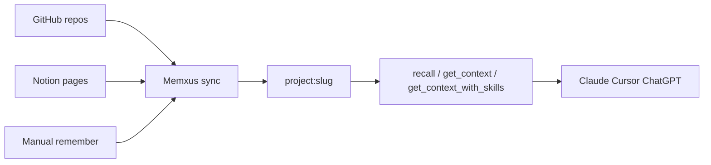

# Memxus — AI Context Engine

<div align="center">

**One context engine. Every AI.**

Builds persistent context from GitHub, Notion, and your saved decisions — delivered to Claude, Cursor, ChatGPT, VS Code, and any MCP-compatible client.

[](https://glama.ai/mcp/connectors/com.memxus/memxus)
[](LICENSE)
[](https://nodejs.org)
[](https://railway.app)
[](https://modelcontextprotocol.io)
[](https://registry.modelcontextprotocol.io)

[Website](https://memxus.com) · [Docs](https://memxus.com/docs/mcp) · [Connect your first AI](https://memxus.com/install) · [Glama Inspector](https://glama.ai/mcp/connectors/com.memxus/memxus)

</div>

---

<div align="center">

[](https://www.youtube.com/watch?v=Tg7BVuEXFm0)

▶️ [**Watch the demo on YouTube**](https://www.youtube.com/watch?v=Tg7BVuEXFm0) · [Demo page](https://www.memxus.com/demo)

</div>

---

## The problem

Every AI tool starts from zero.

Claude doesn't know what Cursor knows. Cursor doesn't know what ChatGPT knows.  
Your stack, project decisions, coding preferences and workflow context get repeated again and again.

**Memxus fixes that with a shared context engine for your AI tools** — not another chatbot, but persistent context built from your real work sources.

> Sync GitHub once → every AI knows your stack. Save a decision in Claude → recall it in Cursor → reuse it in ChatGPT.

---

## What is Memxus?

Memxus is the **AI context engine** — a hosted remote MCP server that automatically builds and delivers persistent project context to every AI client you use.

GitHub repos, Notion docs, commits, PRs, issues, and saved decisions become searchable context. **GitHub and Notion connectors are live in production (v1.1.0)** — connect from the dashboard or directly from chat via MCP connector tools. Skill routing suggests official AI skills matched to your stack.

No local setup.  
No file syncing.  
No copy-pasting context between tools.

Connect once with OAuth and your context becomes portable across your entire AI workflow.

---

## Why developers use Memxus

- Keep project architecture and stack context available across Claude, Cursor, and ChatGPT
- Sync GitHub and Notion into unified project collections — one context per repo
- Stop pasting the same context into every new AI session
- Get official AI skill suggestions matched to your stack (`get_context_with_skills`)
- Share team context across agents and workflows
- Build AI apps with persistent context through MCP or API

---

## Real context from GitHub & Notion

Memxus reads your **real work** — not generic memory snippets. Synced content lands in a unified collection per project: `project:<slug>`.

**What gets synced**

| Source | Content indexed into context |
|--------|---------------------------|
| **GitHub** | Repos, READMEs, commits, pull requests, issues |
| **Notion** | Selected workspace pages and docs |
| **Manual** | Decisions, preferences, and notes via `remember` |

**How to connect**

1. **Dashboard** — [dashboard.memxus.com/integrations](https://dashboard.memxus.com/integrations) (GitHub App + Notion OAuth)
2. **From chat (MCP)** — `connect_source` → `check_connect_status` → `list_syncable_items` → `set_sync_selection`

**How to use synced context**

Call `recall`, `get_context`, or `get_context_with_skills` with `collection=project:<slug>` (or let semantic search find it). GitHub/Notion content is tagged and searchable alongside manual memories.



> **Context Engine tools (6):** visible when *In-app connect* and *Skill routing* are enabled in [dashboard settings](https://dashboard.memxus.com). Production ships the full 15-tool manifest for users with v2 prefs on.

---

## Connect in 30 seconds

```
URL:       https://mcp.memxus.com/mcp
Auth:      OAuth 2.1 (handled automatically)
Transport: Streamable HTTP
```

### Claude Desktop (`claude_desktop_config.json`)

```json
{
  "mcpServers": {
    "memxus": {
      "url": "https://mcp.memxus.com/mcp",
      "transport": "streamable-http"
    }
  }
}
```

### Cursor / VS Code

```json
{
  "mcp": {
    "servers": {
      "memxus": {
        "url": "https://mcp.memxus.com/mcp",
        "transport": "http"
      }
    }
  }
}
```

Or open directly in Glama Inspector →  
[`https://glama.ai/mcp/inspector?url=https://mcp.memxus.com/mcp`](https://glama.ai/mcp/inspector?url=https://mcp.memxus.com/mcp)

For marketplace reviewers: see [REVIEWER.md](REVIEWER.md) for OAuth and Bearer token setup.

---

## Supported platforms

| Platform | Integration | Status |
|----------|-------------|--------|
| Claude Desktop / claude.ai | Remote MCP | ✅ Live |
| Cursor | Remote MCP | ✅ Live |
| VS Code / Copilot MCP | Remote MCP | ✅ Live |
| ChatGPT | Custom GPT / API | ✅ Live |
| Gemini | MCP-compatible workflow | ✅ Live |
| Telegram | Bot connector | ✅ Live |
| **GitHub** | Repo sync (commits, PRs, issues, README) | ✅ Live |
| **Notion** | Workspace page sync | ✅ Live |
| Discord | Bot connector | 🔜 Coming soon |
| Slack | Bot connector | 🔜 Coming soon |
| Any MCP-compatible client | Remote MCP | ✅ Live |

---

## Available tools

Registry `com.memxus/memxus` v1.1.0 — **9 core** tools always available, plus **6 Context Engine** tools when v2 prefs are enabled.

### Core tools (9)

| Tool | Description |
|------|-------------|
| `remember` | Save context — manual input, decisions, or notes; optional `project:<slug>` collection |
| `recall` | Semantic search across memories; GitHub/Notion synced content via `project:<slug>` or tags |
| `get_context` | Formatted context block from GitHub, Notion, and saved decisions for agent prompts |
| `list_memories` | Browse memories by collection, tags, type, or visibility |
| `get_memory` | Retrieve full content and metadata by memory ID |
| `list_collections` | List scopes; GitHub/Notion syncs appear under `project:<slug>` |
| `forget` | Delete a memory permanently |
| `memory_stats` | Stats by type and collection |
| `update` | Patch or append existing memory content, tags, or type |

### Context Engine tools (6) — v1.1.0

| Tool | Description |
|------|-------------|
| `connect_source` | Start GitHub App install or Notion OAuth from chat |
| `list_syncable_items` | List repos or Notion pages available after connecting |
| `set_sync_selection` | Choose what to sync and trigger initial sync into `project:<slug>` |
| `check_connect_status` | Poll connection status after `connect_source` |
| `get_context_with_skills` | Build context + suggest official AI skills for your stack and task |
| `suggest_skills` | Discover skills from skills.sh without a full context block |

Full tool reference: [memxus.com/docs/mcp](https://memxus.com/docs/mcp) · Marketplace reviewers: [REVIEWER.md](REVIEWER.md)

---

## Architecture

```
GitHub App ──┐
Notion OAuth ┼──► sync (API + connector tools) ──► Supabase  project:<slug>
Manual MCP   ┘                                              │
                                                            │ pgvector
MCP Client (Claude, Cursor, etc.)                           │
        │                                                   │
        │  POST /mcp   Bearer aimem_*                       │
        ▼                                                   ▼
  mcp.memxus.com  ← This repo (Railway) ──────────►  Supabase (Postgres + pgvector)
        │
        ▼
  Dash-AIMemory (Dashboard + integrations)
```

Sync runs server-side via dashboard or MCP connector tools — no local files to manage.

**Transport:** Streamable HTTP (MCP 2.0)  
**Auth:** OAuth 2.1 + PKCE + Dynamic Client Registration (RFC 9728)

---

## Security

- OAuth 2.1 + PKCE — no passwords, no API keys to manage
- Encrypted at rest (AES-256)
- User-controlled memory — view, edit and delete anytime from the dashboard
- No local files or manual syncing
- Pre-publication secrets audit passed: 2026-06-17

---

## OAuth flow

```
1. Client  →  GET  /.well-known/oauth-authorization-server
2. Client  →  GET  /oauth/authorize  →  redirect to dashboard login
3. User signs in (Google) in the dashboard
4. Client  →  POST /oauth/token  (PKCE)  →  aimem_* bearer token
5. Client  →  POST /mcp  Authorization: Bearer aimem_*
```

Dynamic Client Registration is supported — clients register automatically on first connect.

---

## Self-hosting

### Prerequisites

- Node 20+
- Supabase project (run `supabase/migration.sql` after the dashboard migration)
- Railway account (or any Node host)

### Environment variables

```bash
cp .env.example .env
```

| Variable | Description |
|----------|-------------|
| `MCP_PUBLIC_URL` | Public URL of this server (no trailing slash) |
| `DASHBOARD_URL` | Dash-AIMemory URL for login redirect |
| `SUPABASE_URL` | Supabase project URL |
| `SUPABASE_SERVICE_ROLE_KEY` | Supabase service role key |
| `OAUTH_CLIENT_ID` | OAuth client ID |
| `ALLOWED_REDIRECT_URIS` | Comma-separated allowed redirect URIs |
| `CORS_ORIGINS` | Comma-separated allowed CORS origins |
| `OPENAI_API_KEY` | _(Optional)_ Vector search embeddings |

### Run locally

```bash
npm install
npm run dev       # tsx watch
npm run build     # tsc → dist/
npm start         # node dist/index.js
```

### Deploy to Railway

Set all variables under **Settings → Variables** (never commit `.env`).  
`MCP_PUBLIC_URL` = your Railway networking URL (no trailing `/mcp`).  
Health check endpoint: `/health` (configured in [`railway.toml`](railway.toml)).

> **Note:** Node 20 on Railway — Supabase Realtime needs the `ws` package (configured in `src/lib/supabase.ts`).  
> Optional: set `RAILPACK_NODE_VERSION=22` for native WebSocket support.

---

## Development

```bash
npm install
npm run dev        # tsx watch
npm run lint       # ESLint
npm run typecheck  # tsc --noEmit
npm run build      # compile → dist/
npm start          # node dist/index.js
```

Marketplace reviewers: [REVIEWER.md](REVIEWER.md) · MCP docs: [memxus.com/docs/mcp](https://memxus.com/docs/mcp) · Registry: `com.memxus/memxus` v1.1.0

---

## Releases

1. Add entries under `## [Unreleased]` in [`CHANGELOG.md`](CHANGELOG.md)
2. Bump version in `package.json`, `server.json`, and `src/mcp/server.ts`
3. Move the changelog section to `## [X.Y.Z] - YYYY-MM-DD`
4. Commit, tag, and push:

```bash
git tag -a vX.Y.Z -m "Memxus MCP vX.Y.Z"
git push origin vX.Y.Z
```

Pushing a `v*` tag triggers [`.github/workflows/release.yml`](.github/workflows/release.yml) — quality gate + GitHub Release with `server.json` attached.

---

## Secrets audit

Run from the repo root before making the repository public.  
**Last audit: 2026-06-17 — PASSED**

```bash
# 1. Verify .env was never committed
git log --all --full-history -- .env .env.local .env.production

# 2. Check for .env* files added in history
git log --all --oneline --diff-filter=A -- "*.env*"

# 3. Grep current tree for dangerous patterns (exclude .example)
git grep -rn -E "(service_role|anon_key|sk-[a-zA-Z0-9]{20,}|aimem_[a-zA-Z0-9]+|eyJ[a-zA-Z0-9_-]{20,})" \
  -- ":(exclude)*.example" ":(exclude)CHANGELOG*"

# 4. Search full git history for leaked keys
git log --all -p --follow -S "service_role" -- . | head -100
git log --all -p --follow -S "SUPABASE_SERVICE_ROLE_KEY=" -- . | head -100
```

| Check | Expected |
|-------|----------|
| Commands 1–2 | No `.env` commits (only `.env.example` in initial commit) |
| Command 3 | Only placeholders (`aimem_YOUR_KEY`), test fixtures, SQL comments |
| Command 4 | No real key values in diffs |

If commands 1 or 4 find real secrets, rotate keys immediately and run `git filter-repo --path .env --invert-paths` before publishing.

---

## Roadmap

- [x] GitHub connector (repo sync → `project:<slug>`)
- [x] Notion connector (workspace page sync)
- [x] MCP Registry v1.1.0 (`com.memxus/memxus` — AI Context Engine)
- [x] Context Engine tools (connect + skills routing)
- [ ] Discord bot connector
- [ ] Slack bot connector
- [ ] Refresh tokens
- [ ] Multi-client OAuth UX
- [ ] npm publish

---

## License

Licensed under the **GNU Affero General Public License v3.0 (AGPL-3.0)**.

You can use, modify, and distribute this code freely. If you use it to run a network service (SaaS), you must publish your source code under the same license.

© 2026 Gabriel Pitrella · [memxus.com](https://www.memxus.com)
