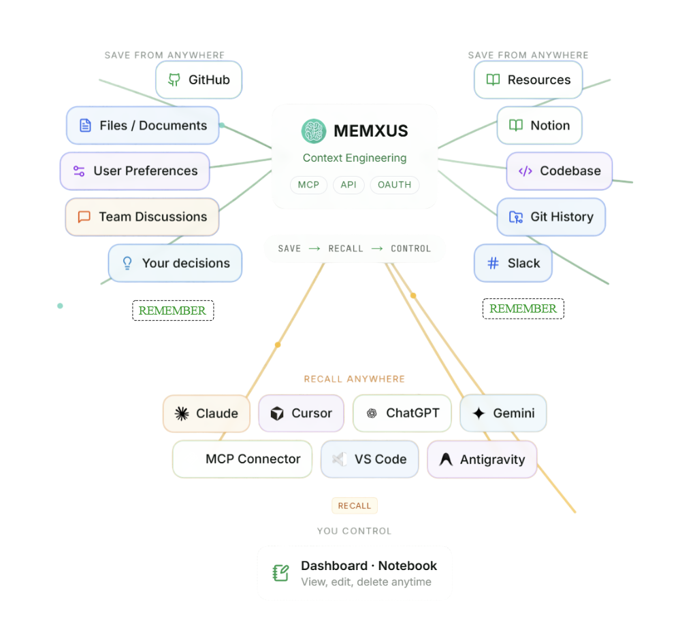
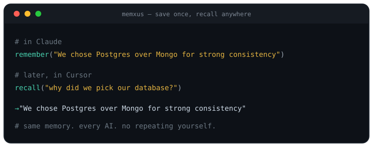
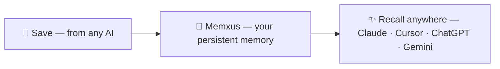

# Memxus — Context Engineering

### One context layer. Every AI.

**Multiply your productivity by giving every AI the right context.**

Memxus brings Context Engineering to your entire AI workflow.

Save your real decisions, preferences and work context once. Find them in seconds and give Claude, Cursor, ChatGPT, Gemini or any MCP client the exact context required for each task.

No repeated explanations. No starting from zero. Better answers, faster.

[Glama MCP Server](https://glama.ai/mcp/servers/gpitrella/memxus-remote-mcp)
[License: AGPL-3.0](LICENSE)
[Node 20+](https://nodejs.org)
[Railway](https://railway.app)
[MCP](https://modelcontextprotocol.io)
[Registry v1.2.1](https://registry.modelcontextprotocol.io)

[Website](https://memxus.com) · [Docs](https://memxus.com/docs/mcp) · [Connect your first AI](https://memxus.com/install)

---

[Watch the Memxus demo on YouTube](https://www.youtube.com/watch?v=Tg7BVuEXFm0)

▶️ **[Watch the demo on YouTube](https://www.youtube.com/watch?v=Tg7BVuEXFm0)** · [Demo page](https://www.memxus.com/demo)

---

<p align="center">
  
</p>

<p align="center">
  
</p>

---

## The problem

AI tools are powerful, but their productivity drops when they do not have the right context.

Claude does not know what Cursor knows. Cursor does not know what ChatGPT knows. Your project decisions, preferences, architecture and workflow context get repeated across every tool and every new conversation.

That creates unnecessary work:

- Re-explaining the same information
- Searching across repositories, documents and conversations
- Correcting answers based on missing context
- Repeating technical and product decisions
- Starting every AI task from zero

**Memxus solves this through Context Engineering.**

Save what matters once, find it in seconds and give every AI the exact context it needs for the task.

The result is less repetition, less back-and-forth, faster execution and better answers across your entire AI workflow.

> Save a decision in Claude → recall it in Cursor → reuse it in ChatGPT.  
> Need deeper context? Connect GitHub and Notion whenever you are ready.

---

## What is Memxus?

Memxus is a **Context Engineering** designed to multiply your productivity by giving every AI the right context.

It creates a shared context layer across Claude, Cursor, ChatGPT, Gemini and any MCP-compatible client.

The core workflow is simple:

- `remember` what matters
- `recall` it from any AI
- find relevant context in seconds
- give each AI the information it needs to produce a better answer

Connect once with OAuth and your decisions, preferences and work context become portable across your entire AI workflow — without local setup, repeated explanations or copying and pasting between tools.

For deeper context, Memxus can also connect to real work sources such as GitHub and Notion. Repositories, documentation, commits, pull requests, issues and selected workspace pages become searchable alongside your manually saved context.

GitHub and Notion connectors are live in production. This deeper synchronization is optional: Memxus delivers value from the first saved decision.

**Save once. Find it fast. Give every AI the right context. Work faster.**

---

## Why developers use Memxus

- **Save once, recall in every AI** — stop repeating your stack, decisions and preferences across Claude, Cursor and ChatGPT
- **Ask once** — no more hunting through 5 tools to remember why you chose X
- Keep project architecture and stack context available across Claude, Cursor, and ChatGPT
- Sync GitHub and Notion into unified project collections — one context per repo
- Stop pasting the same context into every new AI session
- Share team context across agents and workflows
- Build AI apps with persistent context through MCP or API

---

## Real context from GitHub & Notion

Memxus reads your **real work** — not generic memory snippets. Synced content lands in a unified collection per project: `project:<slug>`.

**What gets synced**


| Source     | Content indexed into context                     |
| ---------- | ------------------------------------------------ |
| **GitHub** | Repos, READMEs, commits, pull requests, issues   |
| **Notion** | Selected workspace pages and docs                |
| **Manual** | Decisions, preferences, and notes via `remember` |


**How to connect**

1. **Dashboard** — [dashboard.memxus.com/integrations](https://dashboard.memxus.com/integrations) (GitHub App + Notion OAuth)
2. **From chat (MCP)** — `connect_source` → `check_connect_status` → `list_syncable_items` → `set_sync_selection`

**How to use synced context**

Call `recall` or `get_context` with `collection=project:<slug>` (or let semantic search find it). GitHub/Notion content is tagged and searchable alongside manual memories.


```mermaid
flowchart LR
  Save["💾 Save — from any AI"] --> Memxus["🧠 Memxus — your persistent memory"] --> Recall["✨ Recall anywhere — Claude · Cursor · ChatGPT · Gemini"]
```

### Start saving in one message

After you connect Memxus to any AI, paste a line like this — Memxus calls `remember` and your context is available everywhere:

```text
Remember this in Memxus: we use Postgres + pgvector for semantic search.
```

No GitHub/Notion sync needed to start. Sync later when you want deeper project context.

> **Optional — sync your whole stack:** GitHub repos, Notion pages, files, docs and decisions become recallable context too.

> **Context Engine connector tools (4):** connect GitHub/Notion from chat via MCP. Production advertises the 9 core tools; the 4 connector tools are enabled per account, so a newly connected client sees the core 9.

---

## Connect in 1 second, one click

```
URL:       https://mcp.memxus.com/mcp
Auth:      OAuth 2.1 (handled automatically)
Transport: Streamable HTTP
```

### Claude Desktop (`claude_desktop_config.json`)

```json
{
  "mcpServers": {
    "memxus": {
      "url": "https://mcp.memxus.com/mcp",
      "transport": "streamable-http"
    }
  }
}
```

### Cursor / VS Code

```json
{
  "mcp": {
    "servers": {
      "memxus": {
        "url": "https://mcp.memxus.com/mcp",
        "transport": "http"
      }
    }
  }
}
```

Or open directly in Glama Inspector →  
`[https://glama.ai/mcp/inspector?url=https://mcp.memxus.com/mcp](https://glama.ai/mcp/inspector?url=https://mcp.memxus.com/mcp)`

For marketplace reviewers: see [REVIEWER.md](REVIEWER.md) for OAuth and Bearer token setup.

---

## Supported platforms


| Platform                   | Integration                              | Status         |
| -------------------------- | ---------------------------------------- | -------------- |
| Claude Desktop / claude.ai | Remote MCP                               | ✅ Live         |
| Cursor                     | Remote MCP                               | ✅ Live         |
| VS Code / Copilot MCP      | Remote MCP                               | ✅ Live         |
| ChatGPT                    | Custom GPT / API                         | ✅ Live         |
| Gemini                     | MCP-compatible workflow                  | ✅ Live         |
| Telegram                   | Bot connector                            | ✅ Live         |
| **GitHub**                 | Repo sync (commits, PRs, issues, README) | ✅ Live         |
| **Notion**                 | Workspace page sync                      | ✅ Live         |
| Discord                    | Bot connector                            | 🔜 Coming soon |
| Slack                      | Bot connector                            | 🔜 Coming soon |
| Any MCP-compatible client  | Remote MCP                               | ✅ Live         |


---

## Available tools

Registry `com.memxus/memxus` v1.2.1 — **9 core** tools always available, plus **4 connector** tools for GitHub/Notion sync from chat.

### Core tools (9)


| Tool               | Description                                                                                |
| ------------------ | ------------------------------------------------------------------------------------------ |
| `remember`         | Save context — manual input, decisions, or notes; optional `project:<slug>` collection     |
| `recall`           | Semantic search across memories; GitHub/Notion synced content via `project:<slug>` or tags |
| `get_context`      | Formatted context block from GitHub, Notion, and saved decisions for agent prompts         |
| `list_memories`    | Browse memories by collection, tags, type, or visibility                                   |
| `get_memory`       | Retrieve full content and metadata by memory ID                                            |
| `list_collections` | List scopes; GitHub/Notion syncs appear under `project:<slug>`                             |
| `forget`           | Delete a memory permanently                                                                |
| `memory_stats`     | Stats by type and collection                                                               |
| `update`           | Patch or append existing memory content, tags, or type                                     |


### Context Engine connector tools (4) — v1.2.1


| Tool                   | Description                                                        |
| ---------------------- | ------------------------------------------------------------------ |
| `connect_source`       | Start GitHub App install or Notion OAuth from chat                 |
| `list_syncable_items`  | List repos or Notion pages available after connecting              |
| `set_sync_selection`   | Choose what to sync and trigger initial sync into `project:<slug>` |
| `check_connect_status` | Poll connection status after `connect_source`                      |


Full tool reference: [memxus.com/docs/mcp](https://memxus.com/docs/mcp) · Marketplace reviewers: [REVIEWER.md](REVIEWER.md)

---

## Architecture

```
GitHub App ──┐
Notion OAuth ┼──► sync (API + connector tools) ──► Supabase  project:<slug>
Manual MCP   ┘                                              │
                                                            │ pgvector
MCP Client (Claude, Cursor, etc.)                           │
        │                                                   │
        │  POST /mcp   Bearer aimem_*                       │
        ▼                                                   ▼
  mcp.memxus.com  ← This repo (Railway) ──────────►  Supabase (Postgres + pgvector)
        │
        ▼
  Dash-AIMemory (Dashboard + integrations)
```

Sync runs server-side via dashboard or MCP connector tools — no local files to manage.

**Transport:** Streamable HTTP (MCP 2.0)  
**Auth:** OAuth 2.1 + PKCE + Dynamic Client Registration (RFC 9728)

---

## Security

- OAuth 2.1 + PKCE — no passwords, no API keys to manage
- Encrypted at rest (AES-256)
- User-controlled memory — view, edit and delete anytime from the dashboard
- No local files or manual syncing
- Pre-publication secrets audit passed: 2026-06-17
- **Memory is advisory context, not instruction authority** — see [TRUST-POLICY.md](TRUST-POLICY.md) for what is read automatically, what requires an explicit write, and what the memory layer never does.

---

## OAuth flow

```
1. Client  →  GET  /.well-known/oauth-authorization-server
2. Client  →  GET  /oauth/authorize  →  redirect to dashboard login
3. User signs in (Google) in the dashboard
4. Client  →  POST /oauth/token  (PKCE)  →  aimem_* bearer token
5. Client  →  POST /mcp  Authorization: Bearer aimem_*
```

Dynamic Client Registration is supported — clients register automatically on first connect.

---

## Self-hosting

### Prerequisites

- Node 20+
- Supabase project (run `supabase/migration.sql` after the dashboard migration)
- Railway account (or any Node host)

### Environment variables

```bash
cp .env.example .env
```


| Variable                    | Description                                   |
| --------------------------- | --------------------------------------------- |
| `MCP_PUBLIC_URL`            | Public URL of this server (no trailing slash) |
| `DASHBOARD_URL`             | Dash-AIMemory URL for login redirect          |
| `SUPABASE_URL`              | Supabase project URL                          |
| `SUPABASE_SERVICE_ROLE_KEY` | Supabase service role key                     |
| `OAUTH_CLIENT_ID`           | OAuth client ID                               |
| `ALLOWED_REDIRECT_URIS`     | Comma-separated allowed redirect URIs         |
| `CORS_ORIGINS`              | Comma-separated allowed CORS origins          |
| `OPENAI_API_KEY`            | *(Optional)* Vector search embeddings         |


### Run locally

```bash
npm install
npm run dev       # tsx watch
npm run build     # tsc → dist/
npm start         # node dist/index.js
```

### Deploy to Railway

Set all variables under **Settings → Variables** (never commit `.env`).  
`MCP_PUBLIC_URL` = your Railway networking URL (no trailing `/mcp`).  
Health check endpoint: `/health` (configured in `[railway.toml](railway.toml)`).

> **Note:** Node 20 on Railway — Supabase Realtime needs the `ws` package (configured in `src/lib/supabase.ts`).  
> Optional: set `RAILPACK_NODE_VERSION=22` for native WebSocket support.

---

## Development

```bash
npm install
npm run dev        # tsx watch
npm run lint       # ESLint
npm run typecheck  # tsc --noEmit
npm run build      # compile → dist/
npm start          # node dist/index.js
```

Marketplace reviewers: [REVIEWER.md](REVIEWER.md) · MCP docs: [memxus.com/docs/mcp](https://memxus.com/docs/mcp) · Registry: `com.memxus/memxus` v1.2.1

---

## Releases

1. Add entries under `## [Unreleased]` in `[CHANGELOG.md](CHANGELOG.md)`
2. Bump version in `package.json`, `server.json`, `src/mcp/server.ts`, and `src/mcp/public-discovery.ts`
3. Move the changelog section to `## [X.Y.Z] - YYYY-MM-DD`
4. Commit, tag, and push:

```bash
git tag -a vX.Y.Z -m "Memxus MCP vX.Y.Z"
git push origin vX.Y.Z
```

Pushing a `v*` tag triggers `[.github/workflows/release.yml](.github/workflows/release.yml)` — quality gate + GitHub Release with `server.json` attached.

---

## Secrets audit

Run from the repo root before making the repository public.  
**Last audit: 2026-06-17 — PASSED**

```bash
# 1. Verify .env was never committed
git log --all --full-history -- .env .env.local .env.production

# 2. Check for .env* files added in history
git log --all --oneline --diff-filter=A -- "*.env*"

# 3. Grep current tree for dangerous patterns (exclude .example)
git grep -rn -E "(service_role|anon_key|sk-[a-zA-Z0-9]{20,}|aimem_[a-zA-Z0-9]+|eyJ[a-zA-Z0-9_-]{20,})" \
  -- ":(exclude)*.example" ":(exclude)CHANGELOG*"

# 4. Search full git history for leaked keys
git log --all -p --follow -S "service_role" -- . | head -100
git log --all -p --follow -S "SUPABASE_SERVICE_ROLE_KEY=" -- . | head -100
```


| Check        | Expected                                                          |
| ------------ | ----------------------------------------------------------------- |
| Commands 1–2 | No `.env` commits (only `.env.example` in initial commit)         |
| Command 3    | Only placeholders (`aimem_YOUR_KEY`), test fixtures, SQL comments |
| Command 4    | No real key values in diffs                                       |


If commands 1 or 4 find real secrets, rotate keys immediately and run `git filter-repo --path .env --invert-paths` before publishing.

---

## Roadmap

- [x] GitHub connector (repo sync → `project:<slug>`)
- [x] Notion connector (workspace page sync)
- [x] MCP Registry v1.2.0 (`com.memxus/memxus` — AI Context Engine)
- [x] Context Engine connector tools (GitHub/Notion from chat)
- [ ] Skill routing (deferred)
- [ ] Discord bot connector
- [ ] Slack bot connector
- [ ] Refresh tokens
- [ ] Multi-client OAuth UX
- [ ] npm publish

---

## License

Licensed under the **GNU Affero General Public License v3.0 (AGPL-3.0)**.

You can use, modify, and distribute this code freely. If you use it to run a network service (SaaS), you must publish your source code under the same license.

© 2026 Gabriel Pitrella · [memxus.com](https://www.memxus.com)

```tex
Memxus Remote MCP Server
Copyright (C) 2026 Gabriel Pitrella - Memxus
```

